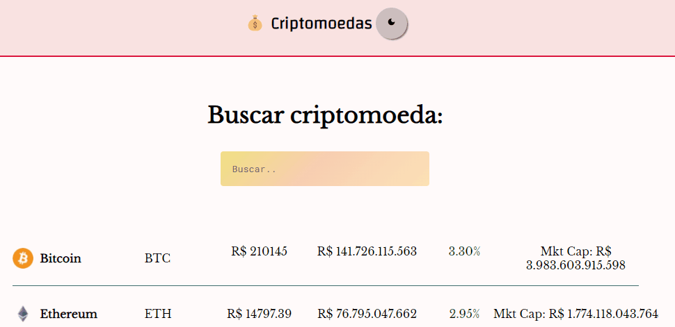

<h1 align="center">Cripto API</h1>

    <a href="#demo">Demo</a>
    <a href="#sobre">Sobre</a>
    <a href="#tecnologias">Tecnologias</a>
    <a href="#sobremim">Sobre mim</a>

---

     

## 🎞 Demo: 

     
    

     

---

     

## 💡 Sobre: 
Projeto desenvolvido para acompanhar o estado das criptomoedas em tempo real. Para uma melhor experiência do usuário, foi colocado alteração de temas da página.

<a href="https://adoring-mahavira-0c4214.netlify.app/">Veja site clicando aqui.</a>

     

---

     

## 💻 Tecnologias: 
<ul>
    <li>React.js</li>
    <li>Consumo de API através do Axios</li>
    <li>React Hooks: useState, useEffect</li>
</ul>

     

---

     

## 👩‍💻 Sobre mim: 

    

        <a href="https://www.linkedin.com/in/ticianne-dias-a7a66b134/">Linkedin</a>
        <a href="https://ticiannedias.github.io/">Currículo online</a>
    

     

---
